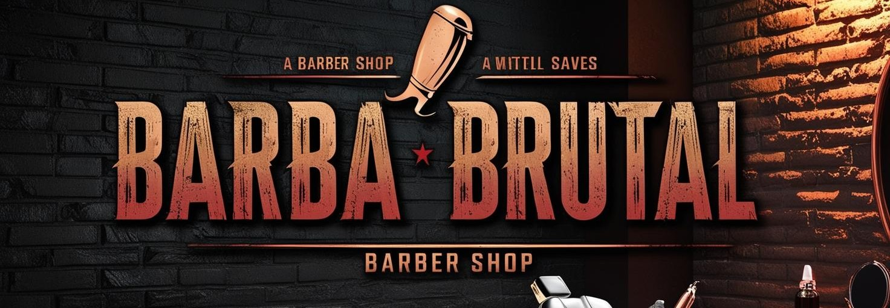

# Barba-Brutal ✂️🔥




## 📌 Sobre o Projeto

**Barba-Brutal** é um sistema completo para uma barbearia moderna! A aplicação oferece serviços de **agendamento**, **login** e **cadastro de usuários**, garantindo uma experiência eficiente para clientes e administradores.

Este projeto é composto por:
- **Frontend**: Interface responsiva e intuitiva construída com **Next.js**.
- **Backend**: API robusta desenvolvida com **NestJS** e **Node.js**.
- **Mobile**: Aplicação mobile desenvolvida com **React Native** e **Expo**.

## 🚀 Tecnologias Utilizadas

O projeto foi desenvolvido com as seguintes tecnologias:
- **TypeScript**
- **Next.js**
- **NestJS**
- **Node.js**
- **React Native (Expo)**

## 📂 Estrutura do Projeto

```bash
barba-brutal/
├── apps/
│   ├── backend/     # O backend do projeto
│   ├── frontend/    # O frontend do projeto
│   └── mobile/      # app mobile
├── packages/
│   ├── core/        # O pacote @barbabrutal/core
│   ├── ui/          # UI compartilhado
├── package.json     # Configuração dos workspaces
```

## 🎯 Funcionalidades

✔️ Cadastro e autenticação de usuários 🔑
✔️ Agendamento de serviços ✂️
✔️ Dashboard administrativo 📊
✔️ Integração entre web e mobile 📱💻

## 🛠️ Como Rodar o Projeto

### Backend
```bash
cd backend
npm install
npm run start
```

### Frontend
```bash
cd frontend
npm install
yarn dev
```

### Mobile
```bash
cd mobile
npm install
expo start
```

## 📞 Contato

Desenvolvido por **Viviane Aguiar** 💜

[](https://www.instagram.com/vivianezzt/)
[](https://www.linkedin.com/in/vivianezzt/)

